# MEAN-stack-angular

*Demonstration of how to implement a simple book register web form using a MEAN stack. The source code used on this project was retrieved from darey.io.*

    Happy learning!

## MEAN STACK

MEAN STACK is a combination of the following components:

- MongoDB (document based) Stores and allows to retreive data.

- Express which is a back-end application framework that makes requests to Database for Reads and Writes.

- Angular (Front-end application framework) – Handles Client and Server Requests.

- Node.js (JavaScript runtime environment) – Accepts requests and displays results to end user. 

First, we need to create an account on AWS. Then we need to sign into our AWS account and setup a new Elastic Compute Cloud (EC2) instance, "mean-stack" could be our new EC2 instance's name.

So, we can setup a EC2 free-tier instance such as the: t2.micro family with Ubuntu Server 20.04 LTS HVM.

- As we are setting up our new instance, we give a name to our private key and download it from AWS.

- Then we connect to our new instance through our terminal.

If you have macOS you can just press 'cmd spacebar' and type in 'terminal' to open the terminal.

If you have Windows you will need to download an SSH client such as "Putty"or "MobaXterm" from their website. The following website includes information you on how to do so: 

https://www.clickittech.com/aws/connect-ec2-instance-using-ssh/

**NOTE**: You can get your ipv4 (public-ip address) from AWS:

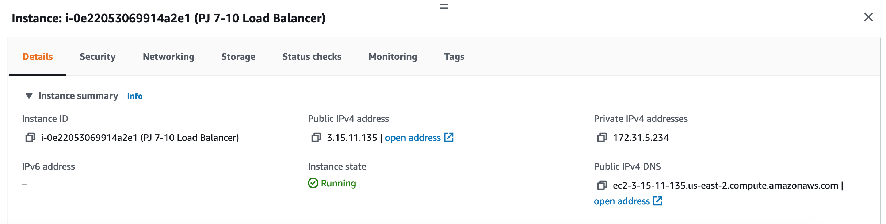

We can see on the images below how to SSH into our EC2 instance:

- We start our instance by selecting our instance and the clicking on "Instance State" then Click "Start instance".

- Once our instance is running, we click on connect.

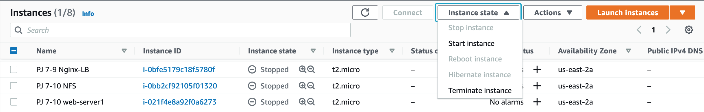

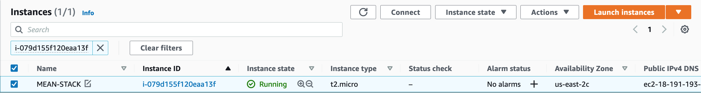

- We click on the 'SSH client' tab and then copy the SSH command that is listed under "Example:"

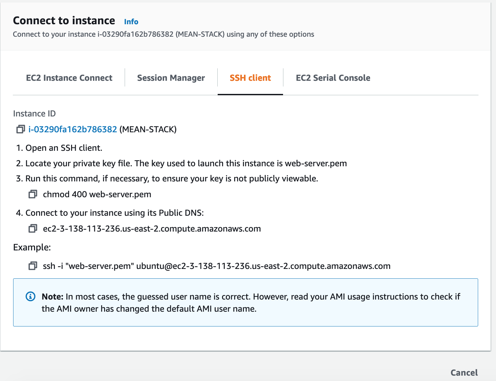

Once we have copied the SSH command, we change directories to our Downloads folder because that is where our private key is located. So we run:

`cd Downloads`

We paste the SSH command into our terminal, then we input yes. If this is the first time that you are doing this, congratulations!! You have just launched your first server in the clouds!

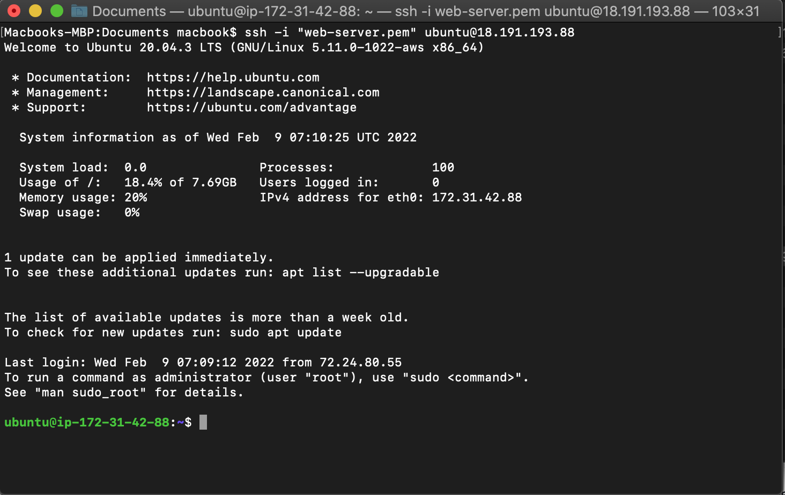

**NOTE**: Here is an explanation of the SSH command:

`ssh -i "private-key.pem" username@ipv4`

- `ssh`: Means 'secure shell' and it is a protocol used to securely connect to a remote server/system.

- `-i`: Flag that specifies an alternate identification file to use for public key authentication.

**NOTE**: *You can use either your EC2 instance's public address or DNS name.*

 So, once we SSH into our EC2 instance, we update the list of available packages:

`sudo apt update`

We install newer version of the packages we have:

`sudo apt upgrade`

### **Installing Node.js** 

We will be using Node.js to set up the Express routes and AngularJS controllers so we run:

`sudo apt install nodejs -y`

### Installing MongoDB

MongoDB stores our data in JSON-like documents.

In this case we will be adding book records to our MongoDB that contain the following: *book name, isbn number, author, and number of pages.*

To install MongoDB we use:

`sudo apt mongodb -y`

Then we start the server:

`sudo service mongodb start` 

We verify that the service is running:

 `sudo systemctl status mongodb`

Then we install npm (Node Package Manager): 

`sudo apt install -y npm`

We also need to install the ‘body-parser’ package to help us process JSON files passed in requests to the server:

`sudo npm install body-parser`

We create a folder named 'Books':

`mkdir Books` 

Then we change directories:

`cd Books`

In our Books directory, we initialize the npm project:

`npm init`

In our root directory 'Books' we create a file named 'server.js':

`vi server.js`

We input or paste the following code in it:

### Installing Express and Set Up Routes to the Server

Express is a minimal and flexible Node.js web application framework that provides features for web and mobile applications. We will use Express to pass book information to and from our MongoDB database.

We also will use Mongoose package which provides a straight-forward, schema-based solution to model our application data. We will use Mongoose to establish a schema for the database to store data of our book register.

So we run:

`sudo npm install express mongoose`

In our 'Books' folder, we create a folder named apps and we change directories to the apps folder:

`mkdir apps && cd apps`

Then we create a file named routes.js:

`vi routes.js`

We input or paste the following code into routes.js:

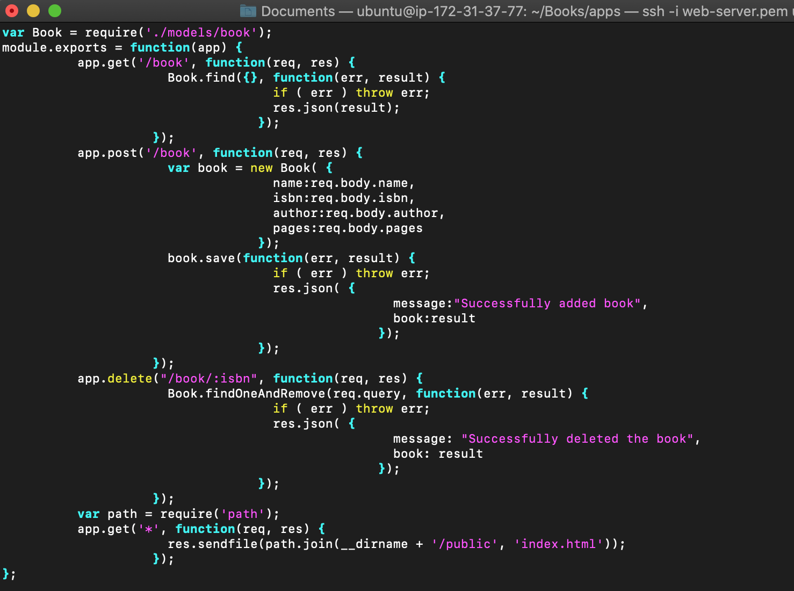

In the 'apps' folder, we create a folder named models:

`mkdir models && cd models`

In the models folder we create a file named book.js:

`mkdir book.js`

We input or paste the following code into book.js:

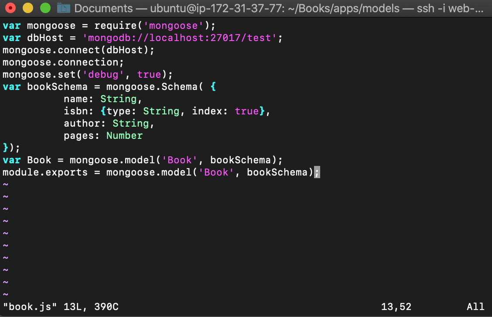

### Accessing the routes with AngularJS

AngularJS provides a web framework for creating dynamic views in your web applications. In this tutorial, we use AngularJS to connect our web page with Express and perform actions on our book register.

So we change the directory back to 'Books':

`cd ../..`

And create a folder named 'public':

`mkdir public`

Then we add a file to it named 'script.js' 

`vi script.js`

We input or paste the following code into our script.js file:

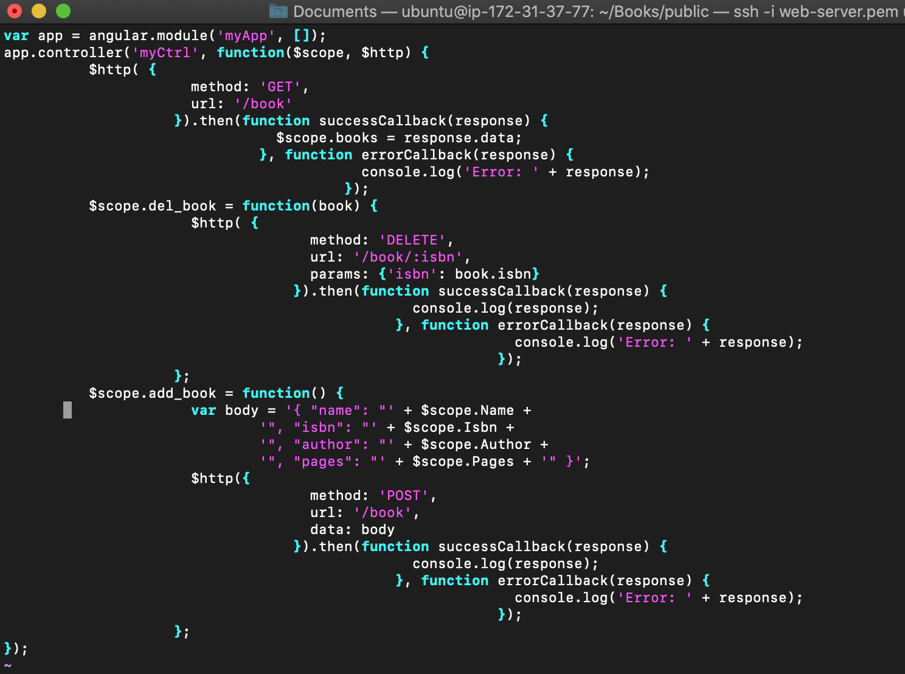

In our public folder, we also create a file named 'index.html'

`vi index.html`

We input or paste the following code into it:

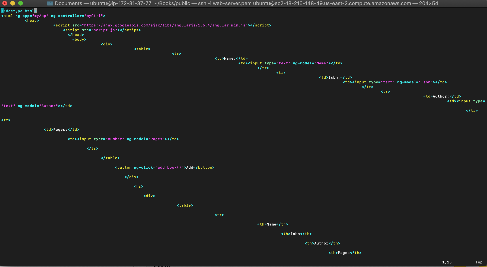

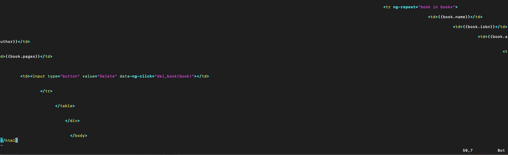

**NOTE**: The identation of the code does not have to be indented as it appears on the picture. The identation can be way simpler and more practical. However, my `vi` text-editor formatted it that way when I pasted it. (I also tried it with `vim` but it formatted it the same way)

Then we change the directory back to 'Books':

`cd ..`

And we start the server by running:

`node server.js`

The server is now up and running, we can connect it via port 3300.

So, let's access it from our browser. However, before doing that, we will need to open a TCP on port 3300 in our AWS Web Console for our EC2 instance and allow access from anywhere. (not ideal for security reasons, but it is good for testing)

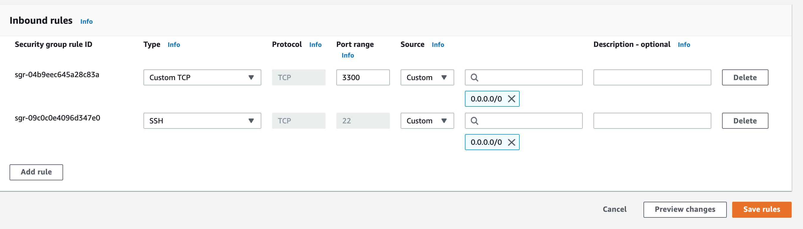

Ultimately, we access our book register web application from the internet with our browser using our EC2 instance's Public IP address or Public DNS name. 'http://localhost:3300'.

**NOTE**: Your localhost is your EC2 instance public-ipv4-address.

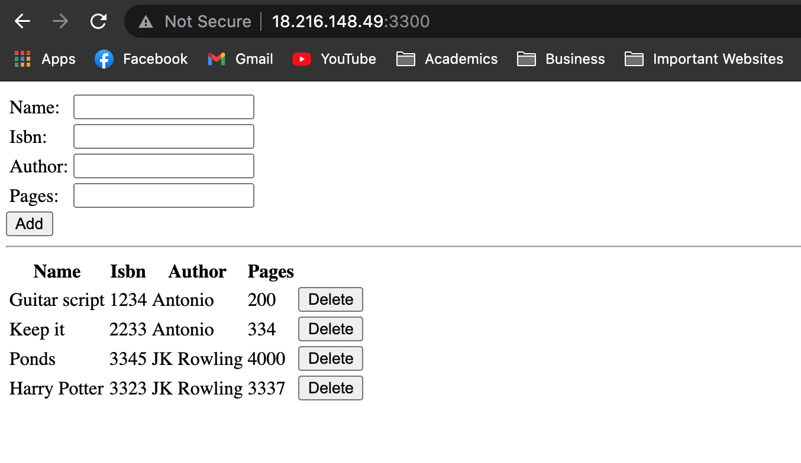