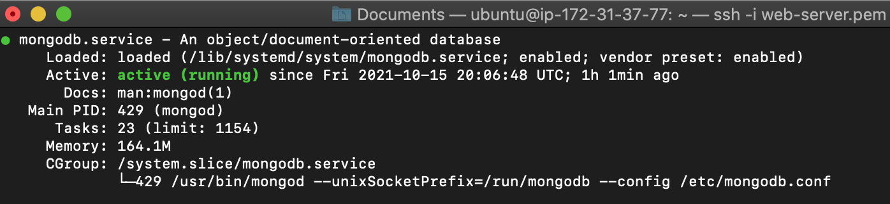

## Project 4 MEAN-STACK

**Implementing a simple book register web form using MEAN stack.**

MEAN STACK is a combination of the following components:

- MongoDB (document based) Stores and allows to retreive data.

- Express which is a back-end application framework that makes requests to Database for Reads and Writes.

- Angular (Front-end application framework) – Handles Client and Server Requests.

- Node.js (JavaScript runtime environment) – Accepts requests and displays results to end user.

First, we sign into my AWS account and setup a new EC2 instance of t2.micro family with Ubuntu Server 20.04 LTS (HVM) • Save my private key • Connect to my EC2 instance through my Mac terminal.

 We update the list of available packages:

`sudo apt update`

We install newer version of the packages we have:

`sudo apt upgrade`

 Now, we install node.js.

### **Installing Node.js** 

We will be using Node.js to set up the Express routes and AngularJS controllers. 

`sudo apt install node.js -y`

Now we will proceed to install MongoDB.

### Installing MongoDB

MongoDB stores our data in JSON-like documents.

In this case we will be adding book records to our MongoDB that contain the following: *book name, isbn number, author, and number of pages.*

To install MongoDB we use:

`sudo apt mongodb -y`

Then we start the server:

`sudo service mongodb start`. 

We verify that the service is running:

 `sudo systemctl status mongodb`

Then we install npm – Node package manager: 

`sudo apt install -y npm`

We also need to install the ‘body-parser’ package to help us process JSON files passed in requests to the server:

`sudo npm install body-parser`

We create a folder named 'Books':

`mkdir Books` 

Then we change directories:

`cd Books`

In our Books directory, we initialize the npm project:

`npm init`

In our root directory 'Books' we create a file named 'server.js':

`vi server.js`

We input the following code in it:

### Installing Express and Set Up Routes to the Server

Express is a minimal and flexible Node.js web application framework that provides features for web and mobile applications. We will use Express to pass book information to and from our MongoDB database.

We also will use Mongoose package which provides a straight-forward, schema-based solution to model our application data. We will use Mongoose to establish a schema for the database to store data of our book register.

So we run:

`sudo npm install express mongoose`

In our 'Books' folder, we create a folder named apps and we change directories to the apps folder:

`mkdir apps && cd apps`

Then we create a file named routes.js:

`vi routes.js`

we input the following code into routes.js:

In the 'apps' folder, we create a folder named models

`mkdir models && cd models`

In the models folder we create a file named book.js

`mkdir book.js`

We input the following code into book.js

### Accessing the routes with AngularJS

AngularJS provides a web framework for creating dynamic views in your web applications. In this tutorial, we use AngularJS to connect our web page with Express and perform actions on our book register.

So we change the directory back to 'Books'

`cd ../..`

And create a folder named 'public' `mkdir public` and add a file to it named 'script.js' `vi script.js`

Input the following code into our script.js file

In our public folder, we also create a file named 'index.html'

`vi index.html`

We paste the following code into it:

Then we change the directory back to 'Books'.

`cd ..`

And we start the server by running:

`node server.js`

The server is now up and running, we can connect it via port 3300.

So, let's access it from our browser. However, before doing that, we will need to open a TCP on port 3300 in our AWS Web Console for our EC2 instance and allow access from anywhere. (not ideal for security reasons, but it is good for testing)

Ultimately, we access our book register web application from the internet with our browser using our EC2 instance's Public IP address or Public DNS name. 'http://localhost:3300'.

